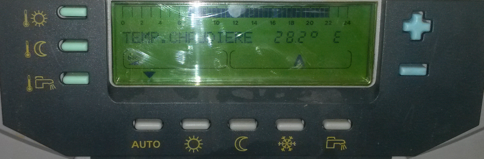
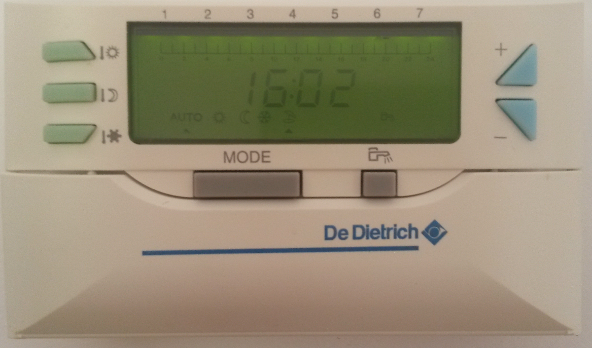

<h2>Making of a web interface for a De Dietrich boiler fitted with a Diematic 3 regulator</h2>

The goal is to be able to control boiler's general setting with a smartphone.

Reminder : Diematic 3 regulator has a built-in control board like :

And a remote control board like :

I remind that if you use information and software available in this repository, It's mean that you feel enough qualified to manage what you are doing and its impacts.

<h2>General Design</h2>
<h3>ModBus Interface Description</h3>

Diematic 3 regulator is fitted with a ModBus interface which allows to read and modify measures and parameters.

There's very few doucmentation on the specification of the De Dietrich ModBus implementation. Used documents can be found on the web by using key words "diematic modbus register"

ModBus rely on data exchange on a serial bus. The Diematic 3 implementation is done with following details :

    RTU (binary) mode, on a RS485 bus
    9600 bauds, 8 bits, no parity, 1 stop bit
    boiler address is 0x0A (hexadecimal)

One specifity of the De Dietrich implementation is the dual-master :
    The boiler transmit ModBus command during 5s as a ModBus master and then remain silent during 5 next seconds  waiting for possible ModBus commandas slave (address: 0x0A).

This particularty will have some impact on the behviour of our system : reponse time will be between 5 and 10 s (5s waiting for boiler slave mode followed by the data transmission).

My main requirements to design the solution were:
- to not spend too much time
- to not spend too much money
as at the beginning I was not sure to achieved something usable.

It's why I chose to use following elements :
- an interface card USR-TCP-232-24, replaced later by an USR-TCP-232-306 which is delivered in an enclosure and has bigger range for power supply voltage. USR-TCP-232-306 specifications can be found on USR-IOT website and bought averywhere. The interface RS485 port is connected on the ModBus port of the Boiler on on side and to the LAN on the other side. If you need it, you can use some WIFI version.
- my already exist NAS server, running an apache server with a php (5.3) module. Now, the NAS could be replaced by a Rapsberry.
- some pĥp scripts to send user commands to the boiler, get back its status and display it to the user. Writing these script will be the main time consumming task, assuming that the descrition of boiler ModBus registers is very poor
