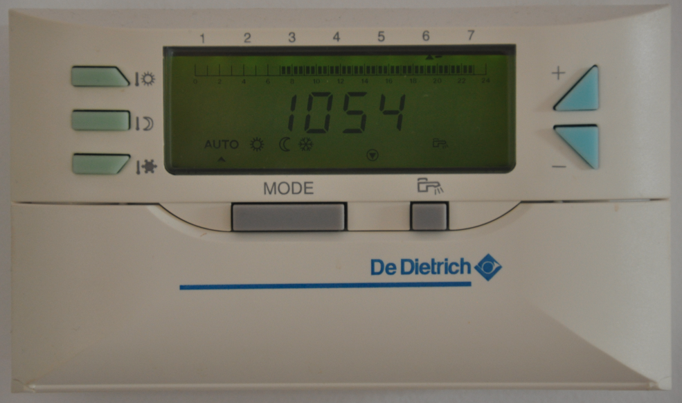
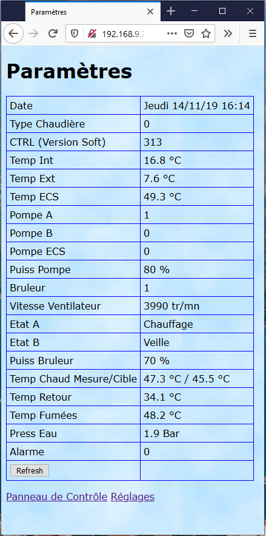
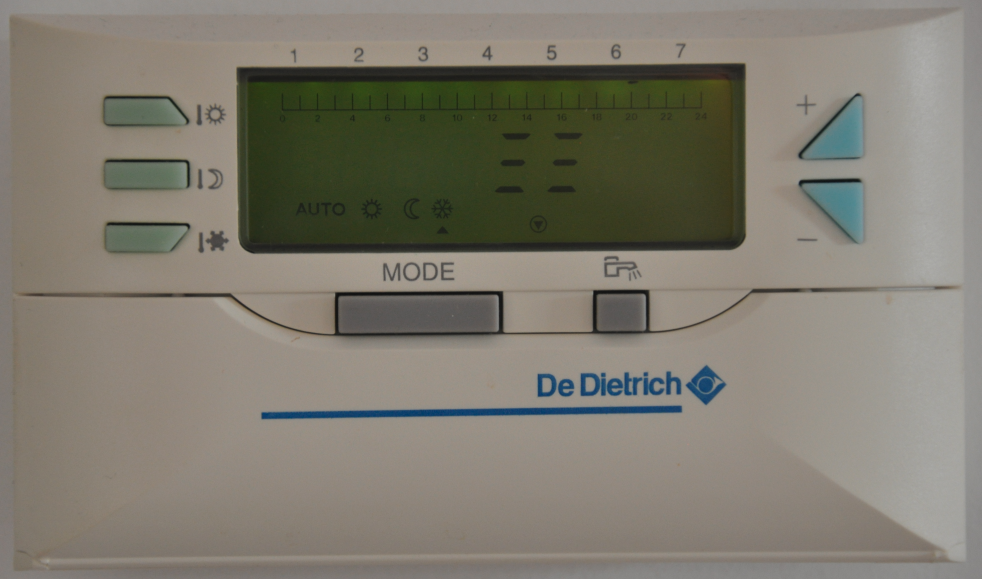

<h2>Making of a web interface for a De Dietrich boiler fitted with a Diematic 3 regulator</h2>

The goal is to be able to control boiler's general setting with a smartphone.

Reminder : Diematic 3 regulator has a built-in control board like :

And a remote control board like :

I remind that if you use information and software available in this repository, It's mean that you feel enough qualified to manage what you are doing and its impacts.

<h2>General Design</h2>
<h3>ModBus Interface Description</h3>

Diematic 3 regulator is fitted with a ModBus interface which allows to read and modify measures and parameters.

There's very few doucmentation on the specification of the De Dietrich ModBus implementation. Used documents can be found on the web by using key words "diematic modbus register"

ModBus rely on data exchange on a serial bus. The Diematic 3 implementation is done with following details :

    RTU (binary) mode, on a RS485 bus
    9600 bauds, 8 bits, no parity, 1 stop bit
    boiler address is 0x0A (hexadecimal)

One specifity of the De Dietrich implementation is the dual-master :
    The boiler transmit ModBus command during 5s as a ModBus master and then remain silent during 5 next seconds  waiting for possible ModBus commandas slave (address: 0x0A).

This particularty will have some impact on the behviour of our system : reponse time will be between 5 and 10 s (5s waiting for boiler slave mode followed by the data transmission).

My main requirements to design the solution were:
- to not spend too much time
- to not spend too much money
as at the beginning I was not sure to achieved something usable.

It's why I chose to use following elements :
- an interface card USR-TCP-232-24, replaced later by an USR-TCP-232-306 which is delivered in an enclosure and has bigger range for power supply voltage. USR-TCP-232-306 specifications can be found on USR-IOT website and bought averywhere. The interface RS485 port is connected on the ModBus port of the Boiler on on side and to the LAN on the other side. If you need it, you can use some WIFI version.
- my already exist NAS server, running an apache server with a php (5.3) module. Now, the NAS could be replaced by a Rapsberry.
- some pĥp scripts to send user commands to the boiler, get back its status and display it to the user. Writing these script will be the main time consumming task, assuming that the descrition of boiler ModBus registers is very poor.

Internet box settings to allow external access to the NAS while complying with good security practice wont be described here. Several solutions can be used according your paranoid status.

<h2>Making of</h2>
<h3>Wiring</h3>

You can start with wiring the USR-TCP-232-306 to the boiler using a 2 wire cable and a mini DIN connector with four pins. The cable schematic is below:

<h3>Module settings</h3>
You can now go on with setting the USR-TCP-232-306  module with a standard web brother :

Remark : I let you read the doc to configure IP parameters of the USR-TCP-232-306. The TCP server address of the above page is not used

<h3>Php pages deployment</h3>

You need to use an Apache/PHP server, pages have been tested with PHP 5.3. Socket module shall be activated.
Script are available [here](web/)

You just need to copy file in the web directory of your apache server and 2 set 4 parameters in the index.php file :
- time zone to use the clock setup feature
- ip address of the USR module
- port of the module (20108 by default)
- default heater circuit of your boiler ( A (default), B or C)

You are now able to browse the index.php page with your favorite browser. Less than 10 seconds later should obtain such result:

This page allows you to control your boiler status and to modify it.

Then if you click on "Parametres" (soory it's in french) you get:

This page allows you to control temperature settings, time and date settings (synchro on server time).

This page allows you to display main parameters of the Diematic 3 regulator, between them the boiler type and software release (313 in this case).

<h3>Limitations</h3>

With this release 313 (boiler bought end of 2006), and this version 1.4 of pages, previous limitations has been solved with sometimes the help of workaround. Temporary anti freezing, is no more available as it was not correctly settable through the Diematic 3 Modbus interface, but permanent antifreezing mode has replaced it. Notice that, in this case the remote control shows below display, which is normal (you can get it with the mode button selecting antifreeze during 5s) :

Main found limitations of the Diematic 3 interfaces are :
- update of remote display heating mode not updatable without "heavy" workaround
- no possibility to switch between programs (P1..P4)
- Pump ECS (water heater) info not robust
- no possibility to use without issue temporary freezing mode
- pump power stays at 100% when all pumps are off

<h3>Miscellaneous</h3>
I've not been successfull to be able to modify the heating program to use ( P1..P4) or to set a temporary antifreeze mode for a given number of day.

The call of url index.php?log=1 allows to display log of ModBus data exchanged.

For further info you can go to [Fibaro forum](https://www.domotique-fibaro.fr/topic/5677-de-dietrich-diematic-isystem/)
